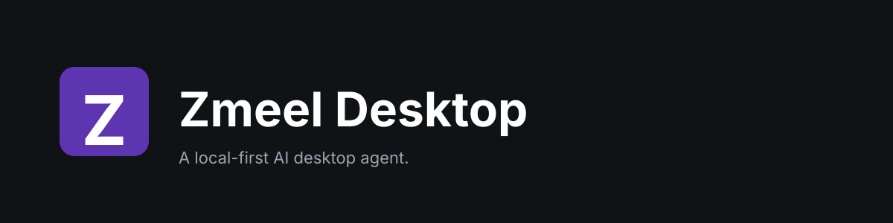

<p align="center">
  
</p>

<p align="center">
  <a href="LICENSE"></a>
</p>

# Zmeel Desktop

Zmeel Desktop is an open-source, local-first AI desktop agent. It runs on your
machine, calls AI providers with your own API keys (OpenAI, Anthropic, Google,
xAI, DeepSeek, etc.) or local models via Ollama / LM Studio, and automates
routine work: file sorting, document drafting, browser tasks, and custom
skills.

> Built on the open-source [Accomplish](https://github.com/accomplish-ai/accomplish)
> project (MIT). See [`NOTICE`](NOTICE) for attribution.

## Status

This repository is an early-stage rebrand-and-refit of the upstream
Accomplish codebase. Builds are unsigned developer builds; there are no
hosted services. All AI traffic goes directly from your machine to the
provider you configure.

## Requirements

- Node.js ≥ 24
- pnpm ≥ 10.33

## Local development

```sh
pnpm install
pnpm -F @zmeel/desktop dev
```

This launches the Electron app in development mode. The window title should
read **Zmeel Desktop**.

To produce an unsigned local build:

```sh
pnpm -F @zmeel/desktop build:electron
```

Artifacts land in `apps/desktop/release/`.

## Project layout

```
apps/
  desktop/   Electron main + preload (Node)
  daemon/    Background daemon process
  web/       Renderer (React + Vite + TypeScript)
packages/
  agent-core/   OpenCode adapter, storage, providers, MCP tools
```

## License

MIT. See [`LICENSE`](LICENSE) and [`NOTICE`](NOTICE).
